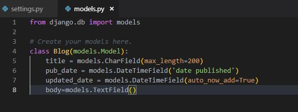

### like_lion_for_Announcement
#### ppt made by dalsa 
#### presenter : minji , junseong
# 멋쟁이 사자처럼 ppt 및 실습(실습은 과정만)

## MTV패턴이란 model-template-view를 의미하는데 여기서는 model에 대해서 알아보고 다음 발표자가 admin에대해 설명해보겟습니다.

### model.py에 아무것도 없기때문에 class라는 틀을이용하여 데이터들을 찍어내는것입니다.

## 클래스를 만들구 데이터 베이스에 manage.py makemigrations 명령어를 통해 알려주고 manage.py migrate를 통해 적용시킵니다. 아래 그림을 참고하면 좋습니다

## ※참고로 settings.py를확인해보면 django에서는 기본적으로 sqlite3를 db로 쓰지만  oracle을쓰고싶으면 django.db.backends.oracle로 바꾸시면 됩니다 그러나 sqlite이외인 즉 oracle을 사용한다면 sql문으로 database를 만들어놔야함.. 

## admin이란

# 실습 
#### 1.django-admin startproject secondproject

#### 2.python manage.py startapp blog

### 3.위의 명령어들로 프로젝트를 생성후 blog라는 app을 추가합니다.

### 4.위의 그림처럼 settings.py에 blog를 등록합니다.

### 설명: models.py에 클래스를만들고 title이라는 변수에 제목을 위한 문자열을 담고
### pub_date에 published date를담고
### body에는 max_length가없는 문자열을담습니다

### 5. python manage.py makemigrations명령어를 통해 migrations를 만들고 python manage.py migrate를통해 DB에 MIGRATE합니다
 
 ### 6.이렇게 잘되었음을 보여주고 뒤에서부터는 python manage.py createsuperuser 명령어를 통해 이어가면됩니다.

